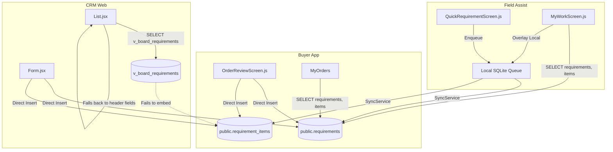

# SL-ORDER-SINGLE-SOURCE-OF-TRUTH-AUDIT-01 Report

## 1. Executive Summary
This READ-ONLY audit verified that all three applications—Shubh Labh Buyer App, Mobile Field Assist, and Shubh Labh CRM—use the **exact same canonical database tables** (`public.requirements` and `public.requirement_items`) to store orders. The business transaction is represented by the same single record across all channels.

The discrepancy observed on the CRM Requirements Board (e.g., displaying "General Requirement" and "1 Bags" for Dudi Trading Company instead of the true line items) is entirely a **display-layer defect**, not a data fragmentation issue. It is caused by an architectural limitation in how the CRM queries its aggregated view (`v_board_requirements`), coupled with placeholder values injected by Field Assist's sync engine to bypass obsolete database constraints.

## 2. Canonical Database Architecture
The canonical data model is confirmed as:
- **Header Table:** `public.requirements` (Stores party_id, notes, status, expected_date, assigned_to).
- **Line Items Table:** `public.requirement_items` (Stores category, product_name, quantity, unit, and references requirement_id).
- **Customer Table:** `public.crm_parties` (referenced by `party_id`).

### Changes to Canonical Model
Originally in Sprint 4 and 8, `product_type` and `quantity` were `NOT NULL` on the header table. However, `211_sprint_demand_live_schema.sql` explicitly executed `ALTER COLUMN product_type DROP NOT NULL` and `ALTER COLUMN quantity DROP NOT NULL`. Despite this, applications were never updated to reflect this schema relaxation, leading to misaligned payloads.

## 3. Order Creation and Read Flows

### A. Shubh Labh Buyer App
**Write:** Direct Supabase insert to `requirements` (leaving product_type and quantity `null`, and mapping address into `notes` JSON), immediately followed by inserts to `requirement_items`.
**Read:** Queries the base table directly: `supabase.from('requirements').select('*, items:requirement_items(*)')`.
*Outcome:* Renders items correctly because PostgREST easily joins base tables via explicit foreign keys.

### B. Mobile Field Assist
**Write:** Local SQLite enqueue -> `SyncService.enqueueOperation`. The `requirements` payload hardcodes `quantity: 1` and `product_type: 'General Requirement'` (lines 289-291 of `QuickRequirementScreen.js`). The `requirement_items` are synced separately but dependently.
**Read:** Queries the base table: `supabase.from('requirements').select('*, requirement_items(*)')` and overlays local SQLite outbox queue state.
*Outcome:* Renders items correctly because the base table query allows PostgREST to embed line items successfully, overriding the hardcoded header.

### C. Shubh Labh CRM
**Write:** Direct Supabase insert. It artificially populates the header `product_type` and `quantity` using the values of the *first* line item, then inserts all line items to `requirement_items`.
**Read:** Queries an aggregated view: `supabase.from('v_board_requirements').select('*, requirement_items(*)')`.
*Outcome:* Renders INCORRECTLY for Field Assist orders. Because `v_board_requirements` contains a `GROUP BY` and `LEFT JOIN`, PostgREST drops the foreign key relationship to `requirement_items`. The requested `requirement_items(*)` resolves to empty/undefined. 

## 4. Dudi Trading Company Record
- **Requirement ID:** The same UUID across all channels.
- **Party ID:** The same UUID across all channels.
- **Database Values:** Header contains `quantity = 1` and `product_type = 'General Requirement'` (written by Field Assist). Line items contain the *true* products and quantities.
- **Field Assist / Buyer App:** PostgREST embedding succeeds. Line items replace the header placeholder. Displays correct products.
- **CRM Board:** PostgREST embedding fails. CRM `List.jsx` mapping falls back to the header's `product_type` (General Requirement) and view's `COALESCE(r.quantity, SUM(...))` (which short-circuits to 1 because 1 is not null).

## 5. Proven Root Cause
The root cause is the combination of three factors:
1. **Field Assist Payload Pollution:** Field Assist injects placeholder data (`1` and `General Requirement`) to satisfy legacy NOT NULL constraints that were actually dropped in Sprint 11.
2. **PostgREST View Limitation:** CRM's `List.jsx` attempts to embed `requirement_items` into the `v_board_requirements` view. PostgREST does not support inferring foreign keys across aggregated views, so no line items are returned to the CRM frontend.
3. **Frontend Fallback Logic:** CRM's `List.jsx` contains fallback logic that defaults to rendering the header's `product_type` and `required_quantity` when the `requirement_items` array is empty, successfully hiding the query failure but presenting the placeholder data.

## 6. Hypotheses Eliminated
- **Eliminated:** Different channels write to different tables. (All use `requirements`).
- **Eliminated:** Duplicate records or partial sync. (The same row ID is used).
- **Eliminated:** Sync queue failure. (Line items *are* successfully written to the database).

## 7. Recommended Corrections
1. **Field Assist Payload Fix:** Remove the hardcoded `quantity: 1` and `product_type: 'General Requirement'` from `QuickRequirementScreen.js` and `VisitContext.js` payloads, as the database no longer enforces NOT NULL on these columns.
2. **CRM View Relationship Fix:** Either:
   - Modify `v_board_requirements` to explicitly return `requirement_items` as a JSONB array via `jsonb_agg()`.
   - Update `List.jsx` to query the `requirements` base table directly and manually join dispatch aggregations.
3. **CRM Header Fallback Fix:** Remove the legacy fallback to header fields in `List.jsx` to ensure any failure to load line items is immediately obvious to developers.

## 8. Data Flow Architecture

